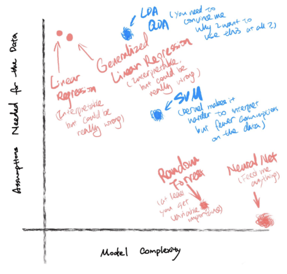

---
output:
  bookdown::gitbook:
    lib_dir: book_assets
---

# Study design phase

It is always exciting to start a new research project. By the time you actually roll-up your sleeves and get your hands dirty, you have probably been pondering on many things that related to your new project: what kind of questions would I like to answer? How should I formalize the question? How do I get to the answer? Should I conduct an experiment to gather some data, or should I explore the existing datasets? What does the data look like anyway? How do I make sure my answer is not wildly wrong? <!-- .... -->

Then you find yourself buried in those questions, do not know where to start… Well, firstly, you are definitely on the right track thinking about all those questions! Congratulations, you just have just taken the first step! Secondly, do not be intimidated by this big fuzzy ball of thoughts. You may not know where to start, how to start, or whether you have thoroughly considered everything to start your research project. This is totally normal! I am here to propose a general framework to get your work started. Let’s call it “the research project starter kit”!

In the following four chapters, I will be introducing concepts, tools, and easy-to-follow frameworks as part of this precious starter kit. I will also share insights on study designs from experienced researchers in different scientific fields. Chapter 1 will discuss how to define the research question, a clear and effective one that we can actually act upon. Chapter 2 will introduce study designs techniques that can answer the research question effectively. Chapter 3  will touch on how to create a realistic analytic plan. Finally, Chapter 4 will provide tools for documenting all the research planning steps.
[add a paragraph] How does the best practice relate to open science? Without well planned study design, open science might be simply unfeasible as you cannot go back in time to retrieve all missing information.


## Define the research question

### Start with a question in mind

A well-defined research question reflects the researcher’s careful thinking of the problem that he/she/they is trying to tackle. Specifying a good research question also serves the researcher a long way:

- Provides clear aims of what to achieve through the study
- Sets reasonable expectations and future goals
- Helps select appropriate methodology moving forward
- Gives a better chance to practice open science 
<!-- - What else can you think of ?...  -->

At this point, you may think, “oh, come on, man! A seasoned researcher like me, of course, knows how to come up with a good research question!” Well, I would say, “Man, think twice!” So what does a well-defined research question look like anyway?  To answer this question, we shall consider the following two aspects:  scientific contribution to the field and operational feasibility. 

To evaluate the scientific contribution: 

- Does the question have a solid scientific base? 
- Is the question novel?
- If the question is sufficiently answered, what will it add to the current knowledge?
<!-- - … -->

To evaluate the operational feasibility: 

- What is the study unit to answer the question? (Individuals? Microbial - colonies? Countries? Planet or celestial systems?
- Does the question include an explicit intervention / treatment / exposure? 
- Does the question imply a comparison group?
- Is there an anticipated outcome?
<!-- - … -->

**Note:** Since academic fields vary, it does not mean that your question has to fulfill all these points mentioned above. However, we do encourage you to go through these questions while you are contemplating the research question. 


```{r pressure, echo=FALSE, fig.cap="Figure credit: https://simplystatistics.org/2019/04/17/tukey-design-thinking-and-better-questions/", out.width = '100%'}

knitr::include_graphics("images/phase-1_quality-of-question.png")

```


### Classification of different questions

Another helpful practice is to carefully scrutinize what kind of question you are asking. It does not mean that some types of questions are absolutely superior to the others. The purpose of thinking through the type of the question allows us to be true to ourselves and honest to our audience when we are making any inferences from our research. Now I will go through two general classifications of reserved questions.


**Confirmatory vs. Exploratory**

- Confirmatory questions typically involve a set of hypotheses, a null hypothesis with one or more alternatives. It often requires the researcher to develop a concrete research design to test these hypotheses. The question is often answered via inductive inference. Such inference is often considered as “strong inference”, and is deemed to make a “scientific step forward”. (Platt 1964) Some examples of confirmatory questions include… add examples!  add reading on inductive and deductive reasoning (maybe the one from Steve’s class)

- Exploratory questions, unlike confirmatory questions, are not explicitly hypothesis driven. Rather, these questions are often considered to be hypotheses-generating. Hence, exploratory questions do not mean to achieve “strong inference”. Results from exploratory research cannot be over-interpreted as something confirmatory, and often yield a higher false positive rate. However, exploratory questions are meaningful and necessary for new discoveries and unexplored topics. Before we make any “strong inference”, we should always attempt to validate the results from exploratory research in a confirmatory setting. Some examples of exploratory questions include… add examples!

In summary, after you carefully think through your research question, it will be more clear to see whether your question is rather hypothesis driven or hypothesis generating. Either way may make interesting research topics, as long as you are making the right amount of inference from the results. Please be true to yourself as the Knights of the Round Table to King Arthur! When you ask an exploratory question, please do not pretend it is confirmatory no matter how hard you want to believe it is confirmatory. When you think you are asking a confirmatory question, make sure it is really confirmatory, not an exploratory question with fancy confirmatory wordings. Believe me, your reviewers will be able to tell!     


**Causal vs. Non-Causal**

Another lens of classifying the research question is to examine whether the question is trying to draw a conclusion about a causal relationship between the indexed exposures and outcomes. As a typical graduate student conducting research, I often find myself either busy establishing an association, or busy determining whether the association I find involves a cause and its effect on the outcome. Although even the famous American writer John Barth once said “The world is richer in associations than meanings, and it is the part of wisdom to differentiate the two.”, this is rather a post-hoc strategy. As having been stressed multiple times, forward thinking is really the key to high quality research. When you have a research question in mind, while thinking about how brilliant your idea is, please also go through the following items to see whether your question is causal or not. The typical causal question includes the following components:

- A well defined cause (what can be qualified as a cause? Still debatable, expand).

- A well defined outcome.

- A scientifically plausible effect on the outcome that can be attributable to the cause.

- Provide a better list of components.

Moreover, English epidemiologist and statistician Austin Bradford Hill carefully summarized the common characteristics of causal relationship in his paper [The Environment and Disease: Association or Causation?](https://www.ncbi.nlm.nih.gov/pmc/articles/PMC1898525/?page=1 in 1965. Although this paper later was referred to as the “Hill Causal Criteria”, Hill himself actually suggested that we should take all these characteristics with a grain of salt. Most of the causal questions contain the “C” word ( C for cause) or the “W” word (W for why). However, a lot of times, causal questions does not explicitly contain the word “cause”, rather, it describes the effect that one factor A has on another factor B. For example: 

- What causes urban residential segregation?

- Why are rural people more politically conservative than urban people in the - United States?

- How effective hydroxychloroquine is in treating COVID-19 patients?

- How does the concentration of silver nitrate affect the formation of silver crystals?

<!-- - ... -->

The two typical classes of non-causal questions we encounter are descriptive questions and observational/associational questions. The former primarily describes the objective existence of certain phenomena. (e.g what is the ductility of bronze, silver, gold?) The latter concerns the relationship between two factors without considering the underlying causal mechanisms. (e.g how does metal ductility relate to its melting point?)

Design an infographic guide for people to go through confirmatory / exploratory and causal / non-causal questions.

**Note:** The takeaway here is that knowing the type of questions that you are asking comes quite handy when determining the downstream analytical methodology and guarding the proper inference! 


### Not All Research Questions Are Hypotheses

_“Every Science begins as philosophy and ends as art; it arises in hypothesis and flows into achievement.”_

_Will Durant_

This section, I would like to further emphasize the characteristics of research hypotheses, as they are the driving force for confirmatory studies and oftentimes the “products” of exploratory studies. As mentioned previously, research questions, as a more general concept, can take on myriad forms with fewer requirements and restrictions; whereas hypotheses, as a subset of research questions, are often phrased in a more specific way with at least one priori belief and one or more alternative(s). It usually does not take on a question form, rather it is a statement, an educated, testable prediction about the results. The main criteria of a good research hypothesis include:

- Written in clear and simple language that clearly defines both the dependent - and independent variables.

- States the priori belief of the relationship between the dependent and - independent variables.

- Variables are defined without scientific ambiguity and are feasible to measure - using either a quantitative or qualitative approach.

- The hypothesis must be testable using scientific methods. (While constructing the hypothesis, one shall try to think of different methods that might be applicable to test your hypothesis).

- The hypothesis is also feasible with respect to the current resources and time frame.

<!-- - ... -->

Here are some examples of  hypotheses:

- Farmed salmon in Norway is more likely to have a higher prevalence of parasitic diseases than the wild salmon. (Good!)

  - My comment: The dependent variable is the prevalence of parasitic diseases. Independent variable is the status of farmed or wild. The predicted effect here is farmed salmon - higher prevalence of parasitic disease. Here the effect is prevalence, which is unambiguous. This is reasonably straightforward to test as well. 

- The extinction of honey will lead to mass extinction to other species, including humans. (Poor!)

    - Now you try to apply the main criteria of a good hypothesis to critique this hypothesis, why does it sound plausible, yet is such a poor hypothesis?

Some fields have their own guidelines on how to generate “tight” hypotheses. For example, [the P.I.C.O framework](http://users.umiacs.umd.edu/~jimmylin/publications/Huang_etal_AMIA2006.pdf) is commonly used in evidence based medicine to formulate high quality clinical questions. The following table summarizes each P.I.C.O component. Although this framework is designed for one particular field, it could be applicable to other scientific disciplines as well. If your research question can be formulated in such a comparison setting, please think through these four components.


```{r, echo=FALSE, message=FALSE}
# Import
pico <- readr::read_csv(file = "tables/phase-1_pico.csv")

# Print
knitr::kable(
  x = pico,
  booktabs = T,
  caption = "The PICO framework"
)
```


_**Protip:** Use study reporting guidelines to navigate your research question formulation process.  When starting a new research project, despite our enthusiasm and motivation, we may still feel quite clueless, especially for us young researchers. Firstly, if you feel this way, fear no more, you are not alone. Secondly, there might be some good news for you. Depending on your study design (coming up in the next chapter), there are corresponding protocols to guide researchers through the study reporting phase. These reporting protocols provide a list of necessary information needed to ensure the transparency of the reported study. These reporting protocols are often developed by a panel of experts within the research field. They can be used to spur high-quality research question/hypothesis generating even at the early stage of a study! Here are several examples of such reporting guidelines:_

- _[Consolidated Standards of Reporting Trials (CONSORT)](http://www.consort-statement.org/) for randomized controlled trials_

- _[Preferred Reporting Items for Systematic Reviews and Meta-Analyses (PRISMA)](http://www.prisma-statement.org/) for systematic reviews and meta-analyses_

- _[Strengthening the Reporting of Observational Studies in Epidemiology (STROBE)](https://www.strobe-statement.org/index.php?id=strobe-home) for observational studies, such as cohort, case-control, and cross-sectional studies, and conference abstracts for these studies_

- _[Case Report Guidelines (CARE)](https://www.care-statement.org/) for case reports_

- _[Consolidated Criteria for Reporting Qualitative Research (CPREQ)](https://academic.oup.com/intqhc/article/19/6/349/1791966) for qualitative research_

- _[Animal Research: Reporting of In Vivo Experiments Guidelines (ARRIVE)](https://arriveguidelines.org/) for research involving experient animals_

- _[Consolidated Health Economic Evaluation Reporting Standards (CHEERS)](https://www.ispor.org/heor-resources/good-practices-for-outcomes-research/article/consolidated-health-economic-evaluation-reporting-standards-(cheers)---explanation-and-elaboration) for economic evaluations_

_**Protip:** Conduct literature review prior to formulate or finalize the research question or hypothesis. In Star Trek Voyager, captain Janeway led her crew to explore the uncharted delta quadrant. (They came from the alpha quadrant.) One obvious reason that they constantly got into trouble (so the show could last for seven seasons) was that they lacked the knowledge of all the planets and new alien species they were dealing with. They called them explorers. And their trip back home was full of treacherous adventures. Trust me, my friend, you don’t want your research to be anything like an adventure! Sufficient literature review prior to formulating or finalizing your research question / hypothesis will provide you a map of the scientific field that you are interested in exploring._ <!-- [Provide resources on teaching literature review.] -->


### Thinking Forward vs. Thinking Backward 
_“By failing to prepare, you are preparing to fail.”_

_Benjamin Franklin_

By now, you may have noticed that the main idea we would like to drive home is “Think ahead of time! Plan ahead of time! Prepare ahead of time! ”. Forward thinking in research conduct allows the researchers not only to better define and understand the research topics themselves, but also anticipate potential contingencies and prepare to tackle the expected “unexpected”. 

Backward thinking in scientific research is not uncommon. Think about the following scenario: you worked hard to generate some seemingly meaningful results. Because you didn’t form any plausible research question, and you were too lazy to conduct a literature review, now you do not know how to interpret the results. “Hey, it’s not too late to start some literature review!”, you said to yourself. Then you put the results in the google search bar and added a question mark in the end. Then you naively think “Voila, problem solved!”. You continued on writing the discussion section of your paper… Please don’t feel ashamed if this situation sounds quite familiar to you, however, you must know by now that this kind of practice is just horrible, period! Backward thinking often leads to HARKing, which stands for Hypothesis After Result is Known. HARKing commonly increases the risk of type I error, and further leads to reproducibility crisis. ([Click this Link to Read more about HARKing.](https://journals.sagepub.com/doi/abs/10.1207/s15327957pspr0203_4))


### Fun Readings and Additional Resources
- [Tukey, Design Thinking, and Better Questions](https://simplystatistics.org/2019/04/17/tukey-design-thinking-and-better-questions/) - a neat blog article on research questions written by [Roger Peng](http://www.biostat.jhsph.edu/~rpeng/) from Johns Hopkins University.
<!-- - ... -->


<!-- Add another small section on generalizability? -->


## Choose Your Study Design

<!-- Add a summary paragraph here.  -->

### But First, Know Your Data

Where does data come from anyway? In general there are three main sources of data for your research:

- Data gathered by researchers themselves. In this case, the researchers are more likely to have a better understanding of the data used in their study, as they are actively involved in the data collecting procedure. Some examples of this kind of “shoe-leather” work include epidemiologists gathering patient-level data from a clinical trial; anthropologist recording interviews of residents from a certain tribe, political scientists conducting polling survey online, earth science researchers collecting information on soil and weather conditions,  electrical engineers simulating a target signal of interest, etc.

- Single-source pre-existing data. In this case, the data has already been gathered mostly for either a more general purpose or a different purpose. But all the information has been consolidated into one dataset, and it is ready to be repurposed for the researchers’ new study. Some examples include bioinformaticians using a subset of U.K biobank data for genetic analysis; nutritionists using a pre-established cohort, such as Stanford Well Living Laboratory to investigate alcohol consumption; econometricians employing Uber driver data to evaluate service quality, etc.

- Multi-source pre-existing data. In this scenario, researchers need to pull data from  multiple existing data sources. The original data sources can be passively collected, such as insurance claims, Facebook user information, or, actively gather data with a study design in place… Researchers have to harmonize the data from different sources to fit the goal of the current study. Some examples are using health insurance claims, hospital registry, and surgeon records to evaluate healthcare quality; employing satellite images and other meteorological measurements to study crops’ growing pattern;

Once we obtain the research data, I don’t know about you, but I get extremely excited! However, before we load everything into any analytic software while humming our favorite tunes, there are several sanity checks we should go over together: 

- How are the study units selected? (Sampling scheme applied? Administrative information?...)

- How is the data collected? (Survey? Interview? Wearable Devices?...)
Are there any underlying data structures that we should be aware of? (Correlated study units? Repeated measurements? …)

Carefully going through these questions will help us anticipate potential biases, choose appropriate analytical methodologies, draw coherent inferences and conclusions, and make planned extrapolations. The following section will point out all the concepts that we need to answer the above questions. In this manual, I will only scratch the surface of these concepts, but provide links to further readings for the keeners!     


## Study Designs
_“We must never make experiments to confirm our ideas, but simply to control them.”_

_Claude Bernard_

### What is study design anyway? - An Important Mind Map

Now, let’s think about planning an epic expedition trip to Yosemite. You want to know the general terrain and geology that you will set your feet on, choose the route that takes you to the Half Dome, bring the right gear to excel your performance. And if you have a bit of extra time, you might also want to test the gear during a shorter hike. Once you reach the top, you take breathtaking photos. Then you come back, tell all your family and friends about how you made it to the top in great details over beer. If this sounds familiar, congratulations, you are a natural in study design. 

Similar to planning an epic hiking trip, the broader concept of study design is the process of planning the **execution protocol** and **analytic method** of your study. By the time you have got a clearly defined research question, the nature of your research question should hint you towards certain study designs, or at least it should help you toss some of the designs into the dumpster. The following section will provide some ideas on how to use the type of questions you are trying to answer to guide you through choosing the appropriate study design.

For now, let’s first go through the components of study design:

- **Execution Protocol** is the core of study design. Most of the time when people talk about study design, they refer to this study execution protocol. Depending on the stage of the research, the protocol may include an array of documentations: the detailed plan on fieldworks to gather population data (human population, microbe population, animals, plants, … ), including the sampling scheme, recruitment strategy, quality control, etc; if the research is related to wet lab, then the protocol shall document all the steps that have been done in the experiments, including the equipment used to process these steps; if human participants are involved, one should also compose the Institutional Review Board (IRB) protocol. If you are using multi-sourced data, the protocol shall elaborate on the data harmonization from different sources. Even if you are using a single-sourced dataset, your inclusion and exclusion criteria could differ from the original data collecting protocol. Hence, in your protocol, you shall document any inclusion or exclusion of records. This will make sure when you are trying to rerun your study, or others are trying to reproduce your study, you will all be on the same page prior to conducting any analysis. To sum up, whatever you do to gather your data, to massage your data prior to the analysis, document all your steps in the execution protocol.

**Note:** Sampling is totally art. The study design should also govern how the study units are sampled either directly via fieldwork, bench work, or from existing data sources.  We will lightly touch on this topic when introducing the types of study designs.
 
- **Analytic Method** should also naturally stem from the kind of question you are asking. Moreover, a lot of times the execution protocol implies a proper set of analytical methods. You may “play around” with your data and get yourself familiarized. We all do that. However, once you decide to take it seriously, plan your analysis prior to generating any results. For example, if your study involves a hypothesis, you shall predetermine how many alternative hypotheses you would like to test. If you are doing a confirmatory study and would like to interpret the effect sizes of independent variables on the dependent variable, you may consider a method that can actually obtain the effect estimator, instead of using some non-parametric method or black-box method, where the effect sizes are not explicit. If you are asking a causal question, the analytical method should be able to fit into the causal inference framework. 
💡Protip: Another great practice is that when you think through all the models picture the following figure, where the x-axis is the model complexity, the y-axis is the number of assumptions of the data the model makes. The fuzziness of the ball indicates the interpretability of the model. Most of the time, there is no perfect model to answer your question, you end up evaluating the tradeoffs among the available methods. This is where knowing your data comes quite handy.

  **Protip:** Another great practice is that when you think through all the models picture the following figure, where the x-axis is the model complexity, the y-axis is the number of assumptions of the data the model makes. The fuzziness of the ball indicates the interpretability of the model. Most of the time, there is no perfect model to answer your question, you end up evaluating the tradeoffs among the available methods. This is where knowing your data comes quite handy.


```{r centuries, echo=FALSE, fig.cap="Figure credit: Yan Min", out.width = '100%'}


```


_**Protip:** If your study involves human subjects, you will need to draft an IRB protocol for approval. Although the purpose of the IRB is not to govern the study quality and rigor but to guarantee the ethical conducts of the research, some of the IRB frameworks can be used as a guiding tool to think through the study execution. Here is the link to the [Stanford IRB office](https://researchcompliance.stanford.edu/panels/hs), you may find a lot more resources from their website._


### Types of Study Designs

The concept of study design exists in almost every academic field. Some study designs are more common in one field than the others; some are widely used across the disciplines but with esoteric names in certain fields. To avoid confusion, I will first discuss the general study design patterns with respect to the question types, then introduce an additional factor - temporality. I will mention specific study design names commonly used in my discipline (Epidemiology)  in several examples, but I will provide the definition of each study design type.

<!-- [need to reorganize my thoughts on this one, can’t be a laundry list of study designs…] -->

<!-- First recall the types of questions we discussed in Chapter 1. Confirmatory vs. Exploratory -->
<!-- Introduce different types of designs, definitions, links -->
<!-- List different types of designs may answer different types of research questions (confirmatory, explanatory, causal?) -->

**Note:** When do you need a study design? If you don’t want to turn your research project into an unwanted surprise, you will always be in need of a study design! 


## Recognize Different Sources of Errors/Uncertainties in Estimation
_“The mistake is thinking that there can be an antidote to the uncertainty”_

_David Levithan_

As long as you conduct scientific research, it is just absolutely inevitable for you to deal with errors/uncertainties of some sorts. However, don’t panic! Although there is no antidote to the uncertainties, anticipating and knowing what kind of error or uncertainty you are dealing with is necessary, so that you can guard your research from being shipwrecked. Different study designs and data types have different intrinsic errors that could reduce the validity or/and accuracy of your study. The following section will, first, introduce different types of errors; then, introduce how different errors can compromise a study; further, provide examples of intrinsic errors for different study designs and data sources;  finally, briefly touch on different methods we can use to evaluate the errors/uncertainties.


### Types of Errors 

Generally speaking, there are three types of errors, namely **random error**, **systematic error**, and **blunders**. The following diagram indicates the classification of errors. 


```{r type-of-error, echo=FALSE, fig.cap="Figure credit: Yan Min", out.width = '100%'}

knitr::include_graphics("images/phase-1_types-of-error.png")
```


- **Random error** (A.K.A unsystematic error) often refers to random noise or random fluctuations that are impossible to remove (irreducible) when taking the measurements. Such errors are usually unpredictable. The exact error cannot be replicated by repeating the measurements again. <!-- [add examples] -->

- **Systematic error** (A.K.A systematic bias) usually results from flaws in the execution of a study, such as the selection of study units, the procedure for gathering relevant information. The error is consistent overtime, if the flaw in the study is not corrected or adjusted. <!-- [add examples] -->

- **Blunders** are just straight mistakes in the process of research conduct. This is unfortunate. However, as long as these mistakes are spotted, it is often easy to correct. We will not spend additional effort to discuss blunders as the previous two types of errors are the “boat-sinkers” in more than 99% of time.

Among all three types of errors, the **systematic error** is the most complicated and can completely nullify the study results. Hence, let’s take a further look at it. As shown in the diagram above, systematic error can be further classified into selection bias, information bias, and confounding bias.

- **Selection Bias** occurs when a systematic error in the inclusion or exclusion of study units happens. The occurrence of such bias may relate to the exposure/treatment of interest, therefore it will give rise to the tendency of distorting the study results from the true result. There are also many different selection bias, such as self-selection bias, differential losses to follow-up, Berksonian bias, etc. <!-- [add examples] -->

- **Information Bias** is caused by erroneous measures of the needed information on the exposure/treatment/independent variable, the outcome/dependent variable, or other relevant covariates. Information bias often results in misclassification of the exposure or/and the outcome. Such misclassifications can be differential or nondifferential. Differential misclassification occurs when the chance of being misclassified differs across study groups (exposed/unexposed groups, treated/untreated groups). The direction and magnitude of the bias needs to be further scrutinized. Nondifferential misclassification occurs when the misclassification is independent from other studied variables (exposure, outcome). It usually biases the results towards the null. <!-- [add examples] -->

- **Confounding Bias** is caused by confounding variables, which have independent associations with both the exposure/treatment/dependent variable and the outcome/dependent variable. Confounding leads to a noncausal association that is likely a distorted version of the true (causal) relationship. Usually by adjusting for the confounders can explain away the observed noncausal association. Confounding is a rather complicated concept. Most of the studies will suffer from some sort of confounding.  <!-- [add examples] -->

**Note:** We are only scratching the surface of all the possible biases that we might encounter in our study. To read more about biases, I find this Catalog of Bias from University of Oxford is quite helpful! 


### How Do Errors Affect Our Study Result?

When you show the study results to your advisor or reviewers, what features of your results would they care the most? Most likely, they will ask you a series of questions regarding precision and validity.

- **Precision** concerns how close the measurements are to each other. As indicated in the figure above, random errors affect the precision of one measurement.

- **Validity** concerns how close the estimate is to the true effect size. Validity includes internal validity and external validity. The latter is also called generalizability. The  internal validity evaluates whether the estimate is close to the true effect size of the study subjects, and it is often affected by systematic errors. The external validity concerns whether the estimate is true, such that the estimate from the current study is close to the true effect sizes in other subjects that are not included in the current study.  For an excellent discussion of validity in relation to measurement and fairness, please refer to [this](https://arxiv.org/abs/1912.05511) paper by Jacobs and Wallach.

As shown in the following figure, the random error alone usually affects the study precision, systematic error affects the study validity. For example, a noisy measurement of the key exposure variable, as a random error by definition, will result in way less concrete inference of the exposure, in some cases, it can be expressed as wide confidence intervals. Whereas, only selecting healthy participants to test out COVID-19 vaccine, as a systematic error, will potentially produce a false conclusion that the vaccine is effective. However, the direction and magnitude of the bias caused by systematic error must be discussed based on the study specific conditions. When both random error and systematic error occur in one study. The results could be quite questionable… But you don’t want to wait till you see this happens in your study. Therefore, **based on what you know about the source of data and your study design, you shall try to anticipate the potential errors that you may encounter.** Hence, address such concerns in the design phase to reduce the chance of having such anticipated errors.


```{r precision-validity, echo=FALSE, fig.cap="Figure credit: Yan Min", out.width = '100%'}

knitr::include_graphics("images/phase-1_validity-precision.png")
```


## Typical Biases in Different Data Sources and Study Designs
 
**Note:** Here, I would like to give a case study as an example of how to incorporate all the things we have talked about into practice. [add case study example]

## How to Reduce and Estimate Different Types of Errors

- **Random Errors.** Again, the random error is unpredictable and non-systematic, and it affects the precision of the study estimate. There are several ways to reduce such error: 
  
    - Provide sufficient uniform training to all the personnel taking the measurements. Maintain good experimental techniques.

    - When taking the measurement, plan to take repeated measurements and take the average. E.g, when measuring the blood pressure of patients, measure three times to avoid random variability of the patient’s blood pressure. When measuring the concentration of a chemical solution, also measure more than one time to take into account the intra-variability of the researcher.

    - Increase the sample sizes. As the standard error is inversely correlated to the sample size N (recall “the square-root law”)

To effectively estimate the random error, we need to consider both the measurement error and the sampling error.  <!-- [add resource] -->

- **Systematic Error.**

    Systematic error, AKA systematic bias comes in different forms. There is no universal panacea to reduce all the systematic errors. The best way to cope with systematic errors is to anticipate the sources and the causes of these biases in your study based on your study design.

    Note that it is possible to correct for systematic bias, if you can adequately characterize that bias. For example, in this study, the authors were able to accurately measure public opinion by polling people on the Xbox. Xbox users are, unsurprisingly, a heavily biased subset of the population. Nevertheless, because the authors had information about the respondents, they were able to correct for this distortion.

    Bias analysis is a very active methodological search field. Most common approach is to conduct different types of sensitivity analysis to evaluate the tolerance of bias in the estimated results.

<!-- [add resources on bias analysis] -->


## Create Your Analytic Plan

### Choose Your Weapon

<!-- [how much should I address this, how to focus on the planning/designing aspect of analytic methods?] -->

<!-- [add figure number] -->

<!-- Quantitative Methods -->

<!-- Causal method, non-causal method -->

<!-- Note:  -->

<!-- Qualitative Methods  -->

<!-- Sensitivity analysis for bias -->


### Mind Your Power

_“Nearly all men can stand adversity, but if you want to test a man’s character, give him power.”_

_Abraham Lincoln_

Inspired by Lincoln’s quote, I am thinking “nearly all research results can stand a long, baffling discussion section in the researcher's own paper, but if you want to test the result’s true scientific plausibility, give the research power!” In statistics, power is defined as the probability of avoiding a Type II error. In other words power is the chance that a test of significance will detect an effect conditioned on the effect does exist. In general, power is related to the prespecified significance level, the study sample size, the number of studied factors/interventions/exposures/treatment, and the anticipated effect sizes. This section is to motivate young researchers to think about power calculation, whenever it is applicable to their studies. For more detailed information on power calculation, I find this simple [tutorial from Boston University](https://sphweb.bumc.bu.edu/otlt/mph-modules/bs/bs704_power/bs704_power_print.html#:~:text=The%20formula%20for%20determining%20sample%20size%20to%20ensure%20that%20the,%3D%200.975%20and%20Z%3D1.960.) very clear and can be a good starting point.

So when do we need to conduct a power calculation? To answer this question, I tend to think about the following criteria:

- Do I need to collect the data?

- Does my research question contain a hypothesis for me to test?

- Is power calculation required because it is part of a grant application?


```{r power_calculation, echo=FALSE, fig.cap="Figure credit: Yan Min", out.width = '100%'}

knitr::include_graphics("images/phase-1_power-calculation.png")
```


Power calculation is commonly conducted when the research question contains a hypothesis to test and the researchers need to design an experiment to collect the first-hand data to test the hypothesis.

For example, a randomized controlled trial to test the effectiveness of a new drug in treating systemic lupus. With limited amounts of time and resources, researchers often need to determine how many people they should enroll in each arm of the study. Assuming the study has two arms, a new drug arm and an old drug arm. Then they need to decide whether the participants match across arms or not, if so, what is the matching ratio? 1 treated to 2 control? Or 1 treated to 5 controls? They then specify a significance level that conventionally set at 0.05, and an anticipated effect size of alleviating the disease symptoms. Once this is in place, researchers may calculate the sample sizes needed to achieve a reasonably high power. This way, the researchers are more likely to find the sweet point of a reasonable sample size that could achieve a reasonable high power. When researchers do not do any calculation and just wing it, if the sample size is way larger than the actual sample size needed to detect the effect, good! They will probably just spend more money and time to conduct the trial. However, if somehow the sample size is not sufficient at all, then they will be in trouble. After having spent all the money and the time to complete the entire trial, the researchers won’t be able to make any concrete conclusion of the drug being tested in the clinical trial. Hence, if possible, always do your power calculation if it is applicable to your research setting. Although power calculation is not the panacea for under-powered studies, it at least provides reasonable guidance on where the results might be heading prior to actually having the data.

Although power analysis is most commonly used in human subjects experiments, it is also relevant to other areas of data science, including user studies and benchmark comparisons. Just as you need a certain number of people in your psychology study to be able to have a decent chance of being able to detect the true effect as significant, you need a sufficient number of raters to be able to test whether people actually prefer your system. Similarly, to provide convincing evidence that your new model is better than the previous state of the art, the test set needs to be big enough to be able to have a good chance of detecting the improvement as significant. For more details on this connection, have a look at <Dallas' paper that will be on arxiv in two weeks>.

**Note:** More articles are pointing out that 0.05 is fairly a low bar for meaningful scientific discovery. Even Fisher himself, who first brought up this 0.05 as the cutoff point, mentioned in his original writing that this 0.05 only means that the result is worth further exploration, which has nothing to do with confirming a scientific finding. <!-- [add citations from Fisher and readings on p < 0.05] -->
 
**Note:** How high the power is high enough? <!-- [add citations] -->


### Need a Pilot?

<!-- [add quote here] -->

#### What is a Pilot Study?

A pilot study is a small-scaled experiment to test the procedure and methods that could be expanded to a larger scale. It is like a mini replica of your actual study. Depending on the needs of the particular study design, the main goals of the pilot study include:

- **Testing the feasibility recruitment protocol and the informed consent process.** This will inform the researchers the feasibility of reaching out to the target population, and anticipate the potential response rate. Researchers will also understand how interested the target population is in the proposed research topic and intervention.

- **Assessing the randomization procedure.** If the study calls for randomization, the randomization procedure itself should be tested prior to the actual study. Since a failed randomization process will jeopardize the overall validity of the study.

- **Testing the “flow” of the study protocol.** The study protocol often involves multiple steps for the researchers and participants to fulfill. The integrity of this “flow” is crucial. For example, after “filtering” participants using the prespecified inclusion/exclusion criteria, the participants will be invited to a lab for blood draw, and then the blood sample will be prepared and transported, etc. All these steps need to be smoothly connected, so that the participants will feel less hectic, and the sample quality is guaranteed.

- **Evaluating metrics used for data collection.** Studies using denovo questionnaires or other forms of data collection tools need to pre-test these approaches in the target population. So that researchers may catch any glitches in the tools before it is too late! Also if there are more than one tools, researchers may use the pilot to compare which tool is the best regarding ease in administering, recording, and analyzing.

- **Gaining insights on the quality and feasibility of gathering data on the study outcomes.** Oftentimes, researchers would like to think of multiple possible outcomes to evaluate the effects from the exposure/intervention/treatment. The gold standard version of the outcome could be the best theoretically, however, in practice, it might not be the case. For example, when measuring fat mass in the target population, we can use body mass index (BMI), where you only need to measure weight and height; or use dual x-ray absorptiometry (DXA) to measure body composition, which tells us the volume of fat mass, lean mass, and bone mass; a third option would be using computed tomography (CT), then we can also differentiate visceral fat from subcutaneous fat. However, assuming we do not know which one is the most feasible, both cost wise and time wise, then we shall use the insights gained from the pilot study to guide our decision making.

- **Familiarizing the research team with the study protocol.** A pilot study can also be the opportunity for the team members to get familiarized with every single step of the study. This can be viewed as part of team training. What kind of error(s) does this step reduce? Random error or blunders! 


### So, Do You Need a Pilot? 

People say you never test the depth of the water with both feet. Hence, my answer to this question would be “Yes, more or less!”.  Whenever you have any concerns or questions regarding the execution of the study, a pilot study may just provide the insight that you need. Since its focus is on the execution instead of the actual analytical results and it is small-scale, a pilot study can amplify the “signals” at each glitch of the research execution. However, we need to be mindful of the kind of concerns that a pilot study cannot address: 

- A pilot study cannot be used to evaluate any adverse effects on the studied population. Specific trial design is needed to evaluate toxicity, safety, and tolerability of an exposure/treatment/intervention.

- It also cannot inform effect sizes used in the sample calculation for the main study. Again the goal of a pilot study is to evaluate the process, not to inform the results. The small sample size for a pilot study usually provides a very unstable estimate of the effect size.

- Following the second point, a pilot study also cannot be used to inform the results of hypothesis testing. Please do not use pilot study to test multiple alternative hypotheses and choose the significant one to be tested in the main study. First, this increases the chance of getting a Type I error (false positive); secondly, something is significant in a pilot study, might not be significant in the main study anyway. (Conditioned on the null hypothesis being true, the p-values actually follow a uniform distribution.)

<!-- [Consider adding a list of additional resources to the end of each part in each chapter.] -->


### Fun Readings and Additional Resources

<!-- ### On Analytical Method -->

<!-- [add more resources] -->

<!-- ### On Power Calculation -->

<!-- [add more resources] -->


#### On Pilot Study

- [Design and analysis of pilot studies: recommendations for good practice.](https://onlinelibrary.wiley.com/doi/epdf/10.1111/j..2002.384.doc.x)

- [Pilot Studies: Common Uses and Misuses.](https://www.nccih.nih.gov/grants/pilot-studies-common-uses-and-misuses)

- [Guidelines for Reporting Non-randomised Pilot and Feasibility Studies](https://pilotfeasibilitystudies.biomedcentral.com/articles/10.1186/s40814-019-0499-1)

- [Internal Pilots for Observational Studies](https://pubmed.ncbi.nlm.nih.gov/20857422/)


## Start Documenting Your Grand Study

_“Documentation is a love letter that you write to your future self.”_

_Damian Conway_

Okay, let’s be honest. Documentation is way less exciting than the previous three parts, but it is a crucial part of all research projects. This Chapter will only serve a motivational purpose on this topic, the following two sections of this manual will discuss this topic in great detail.  <!--[cross reference] --> Simply put, it makes your life easier. Well-documented studies are more likely to be reproduced, first, by yourself; then researchers from other groups. Imagine your reviewers ask you the following questions:

- How the data has been quality-controlled?

- Which participants are excluded in the final analysis? And why?

- Why did you choose 387 as your sample size?

- Could you please change the color of the figure to make them color-blind friendly?

- Before running the blood assays, how were the blood samples prepared?

- Why in the questionnaire you design, question A is after question B? What are your ordering test results?

<!-- - ... -->

These are the kinds of questions that keep me awake at night. To provide the answers, we usually need to go back into the nitty gritty details of the research conduct. What if we did not document all these, should we just count on our vague memory? Trust me, although we are still young, for a majority of us, our memories are not that trustworthy. Of course the motivation of well documenting our research projects should not be to answer questions from the reviewers. What really matters is that we, as primary researchers, know what we have done to your study step-by-step in great details. This is a determination of moving away from sloppy, hand-wavy science! This is always a way to show our love to our future selves by reducing the ambiguity of what has actually been done already. As mentioned earlier, another purpose of documentation is to serve a greater research community and, together, to conduct high quality scientific research. Therefore, the field is populated by high quality, reproducible advancements, instead of spotty significant results here and there. To serve these two purposes, the documentation plan can be divided into internal documentation and external documentation. The former is more self-serving and mostly done on an internal platform, the latter is serving a greater deed in the research community and the scientific field and mostly done on an external platform.


### Internal Documentation

- Sampling and recruiting protocols and any justified modifications.

- Experiment/wet lab routines, procedures, and personnel.

- Protocol and results of the pilot study.

- Development of any instruments/metrics/questionnaires used in the project, and - their validation procedures.

- Device calibration process.

- Data quality control protocols, variable definitions, any kind of data transformations applied prior to the analysis.

- All the analysis that has been performed (not just the one you “like” the most).

- Codes (or software settings) used to generate figures and tables.

<!-- - … -->

<!-- - … -->
